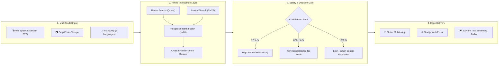

<div align="center">

<!-- Hero Animated Header Banner -->


<!-- Animated Typing Subtitle -->
<a href="https://github.com/Spyro007-06">
  
</a>

<br/>

<!-- Quick Connect & Status Badges -->
[](https://github.com/Spyro007-06)
<!-- REPLACE_WITH_YOUR_LINKEDIN_URL: Update the href link below with your personal LinkedIn profile URL -->
[](https://linkedin.com/in/YOUR_LINKEDIN_URL)
<!-- REPLACE_WITH_YOUR_EMAIL: Update the mailto link below with your email address -->
[](mailto:YOUR_EMAIL@example.com)
<!-- REPLACE_WITH_YOUR_PORTFOLIO_URL: Update the href link below with your portfolio website URL -->
[](https://YOUR_PORTFOLIO_URL)

</div>

---

### 💻 Developer Console

```bash
┌──(tharun㉿spyro)-[~]
└─$ whoami
Tharun B L — AI & Full-Stack Systems Engineer (@Spyro007-06)

└─$ focus --active
["Indic Voice AI", "Grounded RAG Systems", "Offline-First Mobile", "Spatial Backends"]

└─$ core_stack
Python 3.11 • Dart / Flutter • FastAPI • PyTorch • Qdrant • Next.js • PostgreSQL / PostGIS

└─$ philosophy
"Say 'I don't know' out loud. A missing answer beats a confident wrong one."
```

---

## ⚡ About Me

I am an **AI and Full-Stack Systems Engineer** focused on building production-grade, multi-modal applications designed for real-world constraints.

* 🎙️ **Voice AI & Multilingual RAG:** Architecting low-latency hybrid retrieval systems across 5+ Indic languages (Hindi, Tamil, Telugu, Marathi, Malayalam) using dense embeddings, lexical indexes, reciprocal rank fusion, and neural rerankers.
* 🌾 **Domain-Grounded Intelligence:** Built **Bhoomi** (Smart India Hackathon SIH26131 / Govt. of Maharashtra), a voice-first crop diagnostics engine with confidence-gated decision pipelines, PostGIS spread tracking, and pesticide OCR veto safeguards.
* 📱 **Full-Stack & Mobile Engineering:** Leading end-to-end development from offline-first **Flutter (Android)** apps and high-performance **Next.js (App Router)** frontends to async **FastAPI** microservices and relational data backends.
* 🛡️ **Reliability First:** Designing systems that know their operational boundaries — replacing hallucinated LLM responses with strict verification gates, citation validation, and human-in-the-loop escalation.

---

## 🎯 Current Focus

<table width="100%">
  <tr>
    <td width="50%" valign="top">
      <h4>🤖 Grounded AI & RAG Systems</h4>
      <p>Building hybrid retrieval architectures combining <b>Qdrant dense vector search</b> with <b>BM25 lexical search</b> via Reciprocal Rank Fusion (RRF) and Cross-Encoder reranking. Enforcing pre/post-generation citation guardrails.</p>
    </td>
    <td width="50%" valign="top">
      <h4>🎙️ Indic Voice AI</h4>
      <p>Engineering sub-second speech-to-speech conversational flows for regional non-English speakers using <b>Sarvam AI</b> (Saarika STT, Bulbul TTS) and Google Gemini with native Server-Sent Events (SSE) token streaming.</p>
    </td>
  </tr>
  <tr>
    <td width="50%" valign="top">
      <h4>📱 Full-Stack & Mobile Products</h4>
      <p>Crafting production-ready cross-platform mobile apps in <b>Flutter (Android)</b> with local SQLite/Hive caching, coupled with reactive web dashboards in <b>Next.js 15 & React</b> and type-safe <b>FastAPI</b> backends.</p>
    </td>
    <td width="50%" valign="top">
      <h4>🌐 Spatial Systems & Architecture</h4>
      <p>Designing geospatial outbreak tracking and spread alerts using <b>PostgreSQL 16 + PostGIS</b>, vector similarity via <b>pgvector</b>, and automated database migrations with <b>Alembic & SQLAlchemy</b>.</p>
    </td>
  </tr>
</table>

---

## 🛠️ Technical Stack

<div align="center">
  <!-- Skill Icons Unified Bar -->
  <a href="https://skillicons.dev">
    
  </a>
</div>

<br/>

| Category | Technologies & Tools |
|:---|:---|
| **Languages** | `Python 3.11` `Dart` `TypeScript` `JavaScript` `SQL (PL/pgSQL)` `Bash` |
| **AI / ML & NLP** | `PyTorch` `Google Gemini API` `Qdrant Vector DB` `BM25 Lexical Index` `Reciprocal Rank Fusion (RRF)` `Cross-Encoder Rerankers` `Multilingual E5` `Hugging Face` `Sarvam AI (Saarika & Bulbul)` |
| **Backend & APIs** | `FastAPI` `Uvicorn` `SQLAlchemy ORM` `Alembic` `Pydantic v2` `Server-Sent Events (SSE)` `RESTful APIs` `AsyncIO` |
| **Frontend & Mobile** | `Flutter (Android)` `Next.js 15 (App Router)` `React 19` `Tailwind CSS` `HTML5 Canvas API` `Vite` |
| **Databases & Storage** | `PostgreSQL 16` `PostGIS (Geospatial)` `pgvector` `Qdrant (Local & Cloud)` `Vercel Blob Storage` `SQLite` |
| **DevOps & Tooling** | `Docker` `Docker Compose` `uv (Astral)` `Git` `GitHub Actions (CI/CD)` `Linux / Bash` `Pytest` `Ruff` |

---

## 🚀 Featured Projects

### 01. Bhoomi — Voice-First Crop Intelligence & Expert Escalation Platform
> **Smart India Hackathon · SIH26131 · Government of Maharashtra**  
> *Early detection and management of crop diseases, pest infestations, and spatial outbreak alerts.*

[](https://github.com/Spyro007-06/Bhoomi)
[](https://github.com/Spyro007-06/Bhoomi)
[](https://github.com/Spyro007-06/Bhoomi)
[](https://github.com/Spyro007-06/Bhoomi)
[-FF6F00?style=flat-square)](https://github.com/Spyro007-06/Bhoomi)

* **Multi-Modal Diagnostic Pipeline:** Farmers photograph affected crops and speak in Marathi or Hindi. An image classifier and voice pipeline determine symptoms with zero typing required.
* **Confidence-Based Decision Gate:** A strict 3-tier routing engine prevents harmful guesses:
  * `Confidence ≥ 0.70` → Delivers verified, step-by-step grounded advisory.
  * `0.45 ≤ Confidence < 0.70` → Triggers the **"Doubt Doctor"** to ask one targeted physical question to break look-alike ties.
  * `Confidence < 0.45` → Transparently admits uncertainty and packages the case for agronomist review in under 3 minutes.
* **PostGIS Spatial Outbreak Alerts:** Automatically calculates geographic outbreak radiuses to alert neighboring farms cultivating the same crop.
* **Pesticide OCR & Safety Veto:** Scans chemical bottle labels to veto improper treatments (enforces strict *Cultural → Biological → Chemical* precedence).
* **Role & Ownership:** Built the **Flutter** mobile client application, connected the full API lifecycle, and integrated offline diagnostic workflows.

```
Stack: Flutter (Android) • Python 3.11 • FastAPI • SQLAlchemy • PostgreSQL 16 • PostGIS • pgvector • PyTorch • Sarvam AI • React
```

---

### 02. Voice-enabled-RAG — Enterprise Multilingual Voice RAG
> **HackerHouse Goa 2026**  
> *Production-ready, async-first Voice Retrieval-Augmented Generation across 5 Indic languages.*

[](https://github.com/Spyro007-06/Voice-enabled-RAG)
[](https://github.com/Spyro007-06/Voice-enabled-RAG)
[](https://github.com/Spyro007-06/Voice-enabled-RAG)
[](https://github.com/Spyro007-06/Voice-enabled-RAG)

* **5 Indic Languages Supported:** Full text and voice interaction in English, Hindi (हिंदी), Tamil (தமிழ்), Telugu (తెలుగు), and Malayalam (മലയാളം).
* **Sub-50ms Hybrid Retrieval:** Combines dense semantic vector retrieval (Qdrant with 384-dim `multilingual-e5-small`) and lexical search (BM25 over 48k+ chunks) merged through **Reciprocal Rank Fusion ($k=60$)**.
* **Cross-Encoder Neural Reranker:** Re-scores candidates using `cross-encoder/mmarco-mMiniLMv2-L12-H384-v1` before prompting the LLM.
* **Dual-Guardrail Architecture:**
  * **Pre-Guard:** Rejects out-of-domain queries before invoking the LLM, eliminating unnecessary API spend and latency.
  * **Post-Guard:** Validates citations and grounds synthesized output against retrieved passages.
* **Streaming Audio Pipeline:** Real-time token streaming via Server-Sent Events (SSE), Sarvam Saarika v2.5 STT, Bulbul v2 TTS, and Google Gemini 2.5 Flash.

```
Stack: Python 3.11 • FastAPI • Google Gemini 2.5 Flash • Sarvam AI • Qdrant • BM25 • Cross-Encoder • uv • Pytest
```

---

### 03. HH_Goa_Task_1 — HackerHouse Goa Builder Studio & Canvas Engine
> **Dynamic Builder ID Card & Profile Picture Synthesis Platform**  
> *Interactive client-side canvas rendering engine with Apple HEIC decoding and cloud blob persistence.*

[](https://github.com/Spyro007-06/HH_Goa_Task_1)
[](https://github.com/Spyro007-06/HH_Goa_Task_1)
[](https://github.com/Spyro007-06/HH_Goa_Task_1)
[](https://github.com/Spyro007-06/HH_Goa_Task_1)

* **Hardware-Accelerated Canvas Engine:** Real-time multi-layer rendering of customizable attendee ID badges and profile avatars across 4 dynamic themes (`sunrise`, `midnight`, `sand`, `palm`).
* **Solo & Team Layouts:** Automatically adapts compositional geometry for individual builders or multi-photo teams (1–3 contributors) without breaking card proportions.
* **Client-Side HEIC Processing:** Converts raw Apple iOS HEIC photos directly inside the browser using `heic2any`, eliminating server compute bottlenecks.
* **Edge Storage & Short Links:** Direct integration with Vercel Blob and `nanoid` for generating permanent, shareable vanity links (`/s/[id]`).

```
Stack: Next.js 15 (App Router) • React 19 • TypeScript • HTML5 Canvas API • Vercel Blob • heic2any • Tailwind CSS
```

---

## 🧠 How I Build — Systems Pipeline

Here is how multi-modal data transforms into reliable, production-grade intelligence in my architectures:



---

## 📊 GitHub Analytics & Activity

<div align="center">

<table border="0">
  <tr>
    <td align="center" valign="top">
      
    </td>
    <td align="center" valign="top">
      
    </td>
  </tr>
  <tr>
    <td colspan="2" align="center">
      <br/>
      
    </td>
  </tr>
</table>

</div>

---

## ⚡ Engineering Philosophy

> **1. Say "I Don't Know" Out Loud**  
> In critical fields like agriculture and health, a missing answer is infinitely better than a confident, destructive hallucination. A production AI system must define its confidence boundaries and escalate gracefully to humans.

> **2. Hybrid Over Hype**  
> Pure vector search misses exact terms, acronyms, and product IDs. Robust retrieval requires pairing dense semantic embeddings with lexical BM25, fused with reciprocal rank fusion and neural rerankers.

> **3. Build for Real Humans**  
> Technology is only as impactful as its accessibility. Building vernacular voice interfaces in Hindi, Marathi, Tamil, Telugu, and Malayalam bridges the divide for millions of non-English speaking users.

> **4. Enforce Invariants at the Core**  
> Safety rules and business contracts belong in database schemas, type systems, and API gates — not as afterthought checks inside user interfaces or fragile system prompts.

---

## 🌱 Currently Exploring

* **Autonomous Multi-Agent Workflows:** Orchestrating deterministic tool calling, stateful evaluation loops, and agent collaboration patterns.
* **Full-Duplex Real-Time Voice:** Building sub-300ms bidirectional conversational WebSockets for natural human-AI dialogue.
* **Edge Inference & Quantization:** Deploying small language models (GGUF / ONNX) and local vector indexing in low-connectivity environments.
* **Distributed Geospatial Pipelines:** Real-time spatial event streaming for environmental monitoring and agricultural telemetry.

---

## 🤝 Connect With Me

<div align="center">

<!-- CONTACT LINKS: Replace placeholders with your genuine profile URLs -->
<a href="https://github.com/Spyro007-06">
  
</a>
&nbsp;
<a href="https://linkedin.com/in/YOUR_LINKEDIN_URL">
  
</a>
&nbsp;
<a href="mailto:YOUR_EMAIL@example.com">
  
</a>
&nbsp;
<a href="https://YOUR_PORTFOLIO_URL">
  
</a>

<br/><br/>

<sub>*Open to collaborative open-source engineering, AI/ML research, and full-stack software development roles.*</sub>

</div>

---

<div align="center">

<!-- Footer Animated Wave Banner -->


</div>
